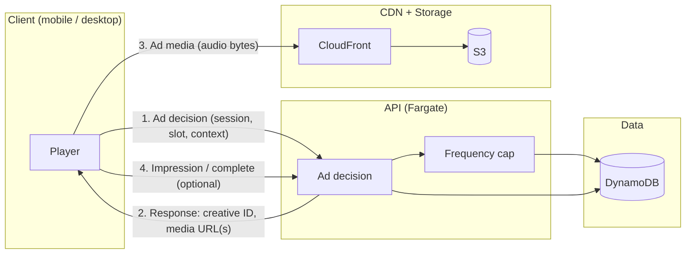

# Indie-Focused Advertising Plan

Architecture for optional, privacy-first advertising on Afterwave.fm: light ad load, indie/local focus, no surveillance or data selling. Ads act as a **stabilizer** during growth and fund the platform without increasing extraction from artists.

See [Streaming + player caching](./STREAMING_AND_PLAYER_CACHING.md), [Sign-up and auth](./SIGNUP_AND_AUTH.md), [Financial scenarios](./FINANCIAL_SCENARIOS.md), and [Architecture](./ARCHITECTURE.md) for context.

## Implementation checklist

- Light ad load (pre-roll, limited mid-roll; caps per user per month)
- Brand-safe categories only; no tracking or personal profiling; no data selling
- Region targeting (coarse IP); Listener/Support ad-free
- Ad decision API and fill path; reporting and billing (aggregate, manual invoicing Phase 1)
- Rollout after core product and Listener/Support tiers in place

---

## 1. Overview

### Why ads exist

- **Financial stability** — Ads provide a second revenue stream alongside artist subscriptions and Listener/Support tiers, reducing reliance on raising artist fees or cutting features.
- **Keep fans free** — Free users can keep a usable experience (discovery + limited streaming) without paying; ads help fund that cost.
- **Avoid raising artist fees** — We do **not** use ads to justify higher artist subscription prices; ads fund the platform so artist fees can stay at $10/month.

### What we will NOT do

- **Tracking** — No cross-site tracking, device graphs, or persistent identifiers for ad targeting beyond what’s strictly needed for frequency capping (e.g. hashed session or coarse bucket).
- **Personal profiling** — No building or buying interest profiles, demographic inference, or “lookalike” audiences.
- **Selling user data** — We do **not** sell, license, or share user data (identity, listening history, or behavior) with advertisers or third parties. Reporting is aggregate only.

**Listener tier ($5/month) and Support tier ($10/month) see no ads.** Free users get ads. The product explicitly promises an ad-free experience for paying fans.

---

## 2. Goals and Non-Goals

### Goals

- **Light ad load** — Pre-roll and limited mid-roll; configurable caps (e.g. 3–10 impressions per user per month); never interrupt every track.
- **Brand-safe** — Allowed categories only (venues, promoters, studios, indie labels, gear, merch, festivals); no gambling, payday, or political microtargeting.
- **Region targeting** — Country/region/city via coarse IP geolocation only; no precise location or GPS.
- **Listener/Support ad-free** — Enforced at API and client; no ad decision or ad media for Listener or Support tier accounts.
- **Simple reporting & billing** — Daily aggregates per campaign + region; manual invoicing (Phase 1); clear CPM and caps.

### Non-Goals

- **Programmatic RTB** — No real-time bidding, open exchanges, or third-party demand that depends on tracking.
- **Cross-site tracking** — No third-party cookies, fingerprinting, or cross-app tracking.
- **Invasive targeting** — No age/gender, interest profiling, retargeting, or device graphs.
- **Personalized ad profiles** — Targeting is context (what’s playing now) and coarse geo only, not “this user likes X.”

---

## 3. Ad Products (Initial)

### Audio

| Format | Duration | Placement | Max frequency |
|--------|----------|-----------|---------------|
| **Pre-roll** | 15 s | Before track starts | 1 per session start (or 1 per N tracks, configurable) |
| **Mid-roll** | 15–30 s | Single break per 20–30 min of listening | Max 1 break per 20–30 min; configurable |

- Pre-roll: one short spot before playback begins (e.g. first track of session or first after app open).
- Mid-roll: one break per 20–30 minutes; inserted at natural boundaries (e.g. between tracks), not mid-song.

### Display (optional)

- **In-app banner** — Single, non-animated banner in a dedicated slot (e.g. bottom of now-playing or discovery). No tracking pixels; same targeting as audio (region + context). Use only if we have direct-sold creative and it doesn’t clutter UX. **Default for MVP: audio only;** add display in a later phase if demand and design justify it.

### Frequency and inventory rules

- **Impressions per user per month:** configurable cap, e.g. **3–10** (default **5**). Stored per user (or per anonymous session bucket) in DynamoDB; ad decision API checks before returning an ad.
- **Session rules:** e.g. max 1 pre-roll per “session” (session = app open until backgrounded or 30 min idle); max 1 mid-roll per 20–30 min of playback.
- **No ad** if cap reached, or if no eligible campaign (fill with house ad or nothing).

---

## 4. Targeting Model (Privacy-First)

### Allowed targeting

| Dimension | Source | Granularity |
|-----------|--------|-------------|
| **Region** | Coarse IP geolocation (e.g. MaxMind GeoIP2 or CloudFront geo headers) | Country → region → city (city optional) |
| **Genre/channel context** | Current playback only | Genre of current track/station; not cross-session history |
| **Time** | Server timestamp | Campaign start/end dates; optional daypart (e.g. evening only) |

- **Context = now.** We use “what is the user listening to right now?” (genre, station, or “discovery” vs “artist page”). We do **not** use “this user’s listening history” to build a profile.
- **Region:** From request IP at ad decision time; no GPS, no precise location, no storage of precise location for ads.

### Disallowed targeting

- **Demographics** — No age, gender, or inferred demographics.
- **Interest profiling** — No “interests” or “affinities” derived from behavior.
- **Retargeting** — No “user who visited X” or “user who listened to Y last week.”
- **Device graph** — No linking devices or identities for targeting.
- **Third-party cookies** — Not used; we don’t rely on or pass third-party cookies.

### “Local ads” when location is unknown or imprecise

- **Unknown:** If IP geolocation fails or returns “unknown,” treat as no region match; campaign can optionally allow “unknown” to receive national or house ads.
- **Imprecise:** Use country or region only; avoid promising “city-only” unless we’re confident in city-level accuracy. For “local” advertisers (venues, studios), we sell by region/country and set expectations: “your ad may show to users in [region],” not “only users within 5 miles.”
- **VPN/proxy:** We do not try to “detect” or override; we use the IP we see and accept some misattribution.

---

## 5. Inventory & Fill Strategy

### The inventory problem

- **Fragmented local demand** — Venues, studios, gear shops want local reach; we may have thin demand in many regions.
- **National supply** — Indie labels, festivals, platforms can fill nationally but may not cover all listening time.
- **Goal:** Maximize direct-sold, brand-aligned inventory; avoid empty or repetitive experience when fill is low.

### Fill hierarchy

1. **Direct-sold local campaigns** — Venues, promoters, studios, local gear shops; targeted by region.
2. **Direct-sold national indie campaigns** — Labels, festivals, tool/plugin brands; run across regions.
3. **House ads** — Afterwave Listener/Support pitch (“Go ad-free, support artists”), or “Featured artist” promos (no payment; we choose). Always available as fallback.
4. **Optional privacy-respecting network (Phase 2+)** — Only if we need fill and find a partner that meets our privacy bar (no tracking, no data sharing, brand-safe). Not in MVP.

### Low fill behavior

- **Never show the same house ad more than N times per user per day** (e.g. 2) to avoid repetition.
- If no paid ad and house ad cap reached: **show no ad** (skip the slot). Prefer “no ad” over a bad or repetitive experience.
- Optionally rotate multiple house creatives (Listener/Support pitch A/B, featured artist A, B, C).

---

## 6. Ad Insertion Architecture

### Principle

- **Ad decision:** API (Go on Fargate) returns *which* ad to play and **CloudFront URLs** for ad media. No audio bytes through the API.
- **Ad media delivery:** Client plays audio from **CloudFront → S3**, same as music. Same signed-URL or signed-cookie model for entitlement; ad media can be in a separate path (e.g. `/ads/` or `/creatives/`) with its own access rules.

### HLS-based playback

- **Option A — Client-side insertion (recommended for MVP):**
  - Client requests “ad decision” before starting a track (or at mid-roll time).
  - API returns ad creative ID, media URL(s), and optionally a pre-built HLS URL for the ad clip.
  - Client plays the ad segment(s) from CloudFront, then continues with the music HLS playlist. No server-side stitching.
  - **Pros:** Simple, no manifest rewriting, works with existing HLS stack. **Cons:** Client must implement ad segment playback and then resume music.
- **Option B — Server-side ad insertion (SSAI):** Stitch ad into the HLS manifest so the client sees one continuous playlist (ad segments + content segments). **Not in MVP;** consider only if we need seamless ad/content transitions and have bandwidth to operate a manifest/stitching service.

**Default: client-side insertion.** Client: (1) call ad decision API, (2) if ad returned, play ad media from CloudFront, (3) fire impression/quartile/complete events, (4) resume music playlist.

### Range-request playback (if used)

- If we ever serve non-HLS (single file + range requests), ad is still a **separate audio asset**. Client: get ad decision → play full ad file from CloudFront (range or full) → then resume track. Same idea: ad media from CDN, not API.

### Ad decision API

- **Endpoint:** e.g. `POST /v1/ads/decision` or `GET /v1/ads/decision` (idempotent, no body or minimal body).
- **Inputs (from client or derived server-side):**
  - **Auth:** Session token (so we know Listener/Support vs free; paid tiers get no ad).
  - **Region:** From `X-Forwarded-For` / CloudFront geo or GeoIP on the server (we do not trust client-reported location for targeting).
  - **Context:** `genre_id` or `channel` (e.g. discovery, artist, station) and optionally `artist_id` for “no ads on my tracks” policy.
  - **Slot:** `pre_roll` | `mid_roll`.
  - **Frequency:** Server looks up per-user (or per-session) impression count for the period and enforces cap.

- **Output:** JSON with ad creative ID, media URL(s) (CloudFront), duration, and optional tracking tokens (our own impression/event URLs, not third-party pixels).

- **No ad case:** Return `204 No Content` or `{"ad": null}` so client skips the slot.

### Request flow (Mermaid)



- **Step 1:** Client calls ad decision with session, slot (pre_roll / mid_roll), and context (genre/channel). API derives region from IP.
- **Step 2:** API checks Listener/Support (no ad), frequency cap, then selects campaign; returns CloudFront URL(s) for ad audio.
- **Step 3:** Client fetches and plays ad audio from CloudFront → S3 (no media through API).
- **Step 4:** Client may call back to API to record impression start and optionally completion/quartiles; API writes to DynamoDB for reporting.

### Example ad decision response (JSON)

```json
{
  "ad": {
    "creative_id": "cre_abc123",
    "campaign_id": "camp_venue_nyc_jan",
    "slot": "pre_roll",
    "duration_seconds": 15,
    "media": {
      "type": "hls",
      "url": "https://cdn.afterwave.fm/ads/cre_abc123/playlist.m3u8"
    },
    "tracking": {
      "impression_url": "https://api.afterwave.fm/v1/ads/events/impression?tid=evt_xyz",
      "complete_url": "https://api.afterwave.fm/v1/ads/events/complete?tid=evt_xyz"
    }
  }
}
```

When there is no ad (cap reached or no fill):

```json
{
  "ad": null
}
```

---

## 7. Measurement & Reporting (Minimal + Honest)

### What we track

- **Impression (started)** — Ad playback started; server-side or client callback with `creative_id`, `campaign_id`, `region`, timestamp. No user ID in reporting; we can store a minimal event ID for abuse detection only.
- **Completion** — User reached end of ad (or 95%+). Used for completion rate and billing (e.g. pay per completion or per impression).
- **Quartiles (optional)** — 25%, 50%, 75%, 100% if we want viewability-style metrics without heavy telemetry. Client fires one request per quartile; server counts. Can defer to Phase 2.

### What we do NOT track

- Cross-site or cross-app behavior.
- User identity in ad reports (aggregate by campaign + region + date only; no “user X saw Y” in reporting).
- Fingerprinting or persistent identifiers for ad targeting.

### Data storage (DynamoDB)

- **Daily aggregates:** `(campaign_id, region, date) → impressions, completions, (optional) quartiles`. Used for reporting and billing.
- **Per-impression logs:** **Minimal or none.** If we keep any, restrict to `(event_id, campaign_id, creative_id, region, date)` and short TTL (e.g. 90 days) for fraud/abuse only; no user ID. **Default: no per-impression log;** aggregate only.
- **Frequency cap state:** Per user or per anonymous bucket: “impressions this month” count; no need to store which creatives.

### Fraud / abuse signals

- **Impossible rates** — Same user/session with hundreds of impressions per day; flag and throttle or exclude from billing.
- **Bot-like behavior** — No or very low completion rate; very short time between impression and “complete”; block or discount.
- **Anomalous geo** — Same “user” from many countries in short time; treat as suspicious.
- **Mitigation:** Rate limit ad decision and event endpoints; cap impressions per session per day; periodic review of campaign-level stats.

---

## 8. Billing & Sales Workflow

### Phase 1: Manual sales + invoicing

- **Sales:** Outbound to venues, labels, festivals, gear brands; simple one-pager with audience (genre, region), formats (pre-roll, mid-roll), CPM or flat fee, and caps.
- **Contract:** Email or PDF; no self-serve. Terms: brand safety, creative specs, start/end dates, budget cap.
- **Creative:** Advertiser uploads audio (and optional banner) via secure link or dashboard; we run QA (loudness, length, content).
- **Invoicing:** Stripe Invoices; we create invoice per campaign or monthly. Payment terms e.g. Net 30.

### Phase 2 (optional later)

- Self-serve dashboard: create campaign, set budget, dates, region, upload creative, pay by card. Not in MVP.

### Campaign constraints (stored in DynamoDB)

- **Budget cap** — Total spend or total impressions; stop when reached.
- **Start / end dates** — Campaign only eligible in this window.
- **Region(s)** — List of countries or regions (from our geo taxonomy).
- **Max frequency** — Max impressions per user per month (global default or overridden per campaign).
- **Genre/channel** — Optional: only show when context matches (e.g. “rock” or “discovery”).

### Creative QA rules

- **Loudness** — Normalize to platform standard (e.g. -14 LUFS or match music); reject or normalize before publish.
- **Length** — Pre-roll ≤ 15 s; mid-roll 15–30 s. Reject if over.
- **Content** — No prohibited categories (gambling, payday, etc.); human review for first run or high reach.
- **Format** — Opus or MP3; we transcode to our delivery format (e.g. 64 kbps Opus for ads) and store in S3.

---

## 9. Brand Safety & Community Alignment

### Allowed categories

- Venues, promoters, studios, rehearsal spaces.
- Indie labels, festivals, events.
- Gear shops (instruments, plugins, recording).
- Merch (band/artist merch, limited to approved partners).
- Local businesses that fit “music community” (e.g. record stores, cafes with live music).

### Disallowed categories

- Gambling, payday loans, adult content.
- Political microtargeting or political ads that use our targeting beyond broad region.
- Deceptive or misleading creative; excessive frequency or intrusive formats beyond what we define.

### Artist controls

- **Opt-out of ads on my tracks:** **Yes.** We support “no ads when my music is playing.” Stored per artist; ad decision API receives `artist_id` in context and skips paid ads (house ad only or no ad) when that artist is playing. Default: opt-in to ads on tracks (i.e. ads can run); artist can opt out in settings.
- **“No ads on my tracks” as default:** **No.** Default is that ads may run during any track; artist can opt out. We avoid fragmenting inventory by making opt-out the default.

---

## 10. Cost & Economics

### Simple model

- **Impressions per month** = free_users × impressions_per_user_per_month  
  (Supporters are excluded; no impressions.)
- **Revenue** = (impressions / 1000) × CPM × fill_rate × (1 − fees)  
  (fees: payment processing, any rev-share if we use a network later.)

### Parameters (examples)

| Parameter | Value | Note |
|-----------|--------|------|
| Impressions per free user per month | 3–5 | Cap; actual depends on fill and session length. |
| Fill rate | 30–70% | Fraction of ad slots filled by paid campaigns; rest house or empty. |
| CPM (direct-sold indie) | $5–15 | Assumption; local/indie often lower than programmatic. |
| Fees | ~3% | Stripe. |

### Example: 250k MAU

- Assume 10% Listener/Support (25k), 90% free (225k).  
- Free users: 225,000. Impressions at 4/user/month: 900,000.  
- At 50% fill, 450,000 paid impressions. At $10 CPM: 450 × $10 = **$4,500/month** from ads.  
- House ads: 450,000 slots (other 50%); no revenue, used for Listener/Support pitch and UX.

### Example: 1M MAU

- Free: 900,000. Impressions at 4/user/month: 3.6M.  
- At 50% fill: 1.8M paid. At $10 CPM: 1,800 × $10 = **$18,000/month** from ads.

### Supporter conversion and ad impressions

- As more users become Listener/Support subscribers, **ad impressions drop** (paid tiers see no ads). That’s intentional: we prefer subscription revenue over ad revenue.  
- Revenue mix: artists + Listener/Support + ads. Ads are a stabilizer; we don’t optimize for max ad load. At 20% paid conversion, we’d have fewer impressions but more subscription revenue.

---

## 11. Rollout Plan

### Milestone sequence (4–8 weeks for MVP)

| # | Milestone | Scope |
|---|-----------|--------|
| 1 | **House ads only** | Ad decision API returns only house creative (Listener/Support pitch). Client implements pre-roll (and optionally mid-roll) using CloudFront URLs; frequency cap in API. No paid campaigns. |
| 2 | **Direct-sold campaigns (manual)** | Campaign and creative in DynamoDB; ad decision selects by region + context + dates; manual upload to S3, Stripe invoices. |
| 3 | **Geo targeting** | Region from IP in ad decision; campaign targeting by country/region. |
| 4 | **Reporting dashboard** | Internal view: daily aggregates per campaign + region (impressions, completions); export for billing. |
| 5 | **Optional network fallback** | Only if we add a privacy-respecting partner; same API contract, fill from network when no direct campaign. |

### Feature flags and kill switch

- **Feature flag:** `ads.enabled` (global or per platform). When off, ad decision API always returns `{"ad": null}`.
- **Kill switch:** Admin or config toggle to disable ads immediately (e.g. brand-safety incident or fill partner issue). Client should handle null ad gracefully (no slot).

---

## 12. Open Questions

| Question | Options / note |
|----------|------------------|
| **CPM assumptions** | $5–15 for direct-sold indie is a guess; validate with early advertisers. |
| **Fill targets** | Aim for 30–50% paid fill in year one; rest house or no ad. Revisit if we add a network. |
| **Display ads** | MVP: audio only. Add in-app banner only if we have demand and a clean design. |
| **Artist opt-out** | Decided: opt-out available (“no ads on my tracks”); default is ads allowed. |
| **Per-impression logs** | Default: no; aggregate only. Revisit if we need dispute resolution or fraud deep-dives. |
| **Quartiles** | Defer to Phase 2; implement if advertisers ask for viewability-style metrics. |

---

## References

- [Streaming + player caching](./STREAMING_AND_PLAYER_CACHING.md) — HLS, CloudFront, S3, no audio through API
- [Sign-up and auth](./SIGNUP_AND_AUTH.md) — Session, Listener/Support vs free
- [Financial scenarios](./FINANCIAL_SCENARIOS.md) — Revenue and cost assumptions
- [Architecture](./ARCHITECTURE.md) — Stack, Fargate, DynamoDB, CloudFront
