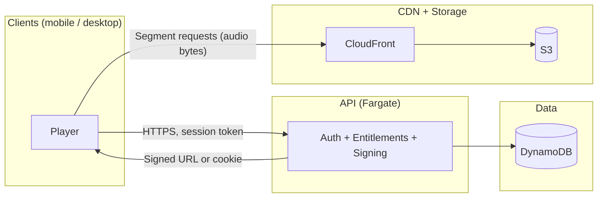

# Streaming + Player Caching

Architecture for chunked streaming, local caching, and cost-controlled playback across mobile and desktop clients. Audio flows **do not** go through the Go API.

See [Architecture](./ARCHITECTURE.md), [Player app](./PLAYER_APP.md), and [Sign-up and auth](./SIGNUP_AND_AUTH.md) for context.

---

## 1. Overview

### What we're building and why

We are building a **Spotify-like playback experience** with:

- **Chunked streaming** — Clients request media segments (e.g. HLS) from the CDN; no proxying through the API. This keeps bandwidth and CPU off Fargate and uses CloudFront for global delivery.
- **Local caching** — Users can replay from device cache without re-downloading. Tracks (or segment ranges) are committed to disk when playback passes a threshold or the user explicitly saves. Cache is LRU with a configurable max size.
- **Background playback** — Mobile (iOS/Android) and desktop must support playing while the app is in the background or minimised; we rely on native audio stacks (React Native + Expo on mobile, Electron + Web Audio or equivalent on desktop).

**Why:** (1) **Cost control** — Bandwidth stays on CDN/S3; free tier has a monthly byte cap (e.g. 100 MB) so we can bound delivery cost per user. (2) **UX** — Fast start, efficient skip (fetch only needed segments), offline replay from cache. (3) **Offline** — Cached content playable without network.

### Key decisions already made

| Decision | Choice | Rationale |
|----------|--------|-----------|
| **Codec** | Opus | Good quality at low bitrate; wide client support; we encode once per tier. |
| **Bitrate** | 64 kbps (free), 128 kbps (supporter) | Cost vs quality; tiered from day one. |
| **Identity** | Cognito | Per [Sign-up and auth](./SIGNUP_AND_AUTH.md); we issue our own session/refresh after Cognito. |
| **Delivery** | CloudFront → S3 | No audio through Go API; signed URLs or cookies for entitlement. |
| **Monetization** | Artists pay; supporter tier $3–5; free tier monthly data cap | Predictable cost and upgrade path. |

---

## 2. Goals and Non-Goals

### Goals

- **Chunked streaming** — Client requests segments (e.g. 4 s) from CDN; start playback quickly; fetch only what’s needed for current position and modest read-ahead.
- **Efficient skipping** — Seek to any position by requesting the segment that contains that time; no need to download the whole file.
- **Offline cache** — Persist segments to disk; replay from cache without re-downloading; respect user-configurable max cache size and LRU eviction.
- **Resumable downloads** — If a segment fetch is interrupted, resume from the next segment or retry the same segment; store partial segments only when we have a complete segment for playback.
- **Rate limiting** — Per-user and per-device limits on segment requests and bytes; free-tier monthly byte cap enforced at issue time (signed URL / cookie scope or API metering).
- **Metrics** — Bytes per user per month, tracks started vs completed, skip rate, cache hit ratio (client-reported), entitlement checks, signed URL issuance; dashboards and alerts for cost anomalies.

### Non-Goals

- **DRM / encryption of media** — We do **not** implement DRM or encrypted media streams. Content is delivered over HTTPS; no additional encryption or license servers. We rely on signed URLs and caps to limit abuse.
- **Advanced watermarking** — No forensic or per-user watermarking for piracy tracing in this design.
- **P2P distribution** — No peer-to-peer or client-assisted distribution unless explicitly added later.

---

## 3. High-Level Architecture

Audio flows **do not** go through the API. The API is used for identity, metadata, entitlements, and issuing short-lived signed access to CDN objects.



- **Client → API:** Authentication (Cognito → our session token), metadata (track/album info), **entitlement check** (supporter vs free, byte cap), and **URL signing** (CloudFront signed URL or signed cookie). No audio bytes.
- **Client → CloudFront → S3:** All **audio** (HLS playlists and segments, or range requests). Client uses the signed URL/cookie from the API to request segments directly from the CDN.
- **DynamoDB:** Users, sessions, refresh tokens, track/album metadata, supporter status, and **monthly byte usage** (for free-tier cap).

---

## 4. Media Packaging Strategy

### Choice: HLS with fMP4 segments (default)

We use **HLS with fMP4 (fragmented MP4)** as the default packaging format.

| Approach | Pros | Cons |
|----------|------|------|
| **HLS + fMP4** | Standard, tooling (FFmpeg, AWS MediaConvert), adaptive variants (64 vs 128 kbps), segment-level caching and seeking, no single huge file per play. | Slightly more complex than one file; need manifest + segments. |
| **Single file + Range requests** | Simple origin (one object per track/bitrate); easy to implement. | Coarse seeking (range alignment); harder to do true “segment” caching and variant switching; more waste on skip. |

**Default: HLS with fMP4.** We get clear variant playlists for 64 kbps vs 128 kbps, segment-level caching at CDN and client, and efficient skip by requesting only the segment that contains the seek target.

### Segment duration: 4 seconds

- **Shorter (e.g. 2 s):** More requests, more overhead, finer skip granularity.
- **Longer (e.g. 6–10 s):** Fewer requests, more waste when user skips early.

**Default: 4 s.** Balances request overhead and skip waste; aligns with common HLS practice. We can tune later (e.g. 2 s for very short tracks if needed).

### Variant playlists (64 kbps vs 128 kbps)

- **Master playlist** — Lists two variants: `free` (64 kbps Opus) and `supporter` (128 kbps Opus). Client chooses variant based on entitlement (API tells client which tier).
- **Per-variant playlist** — Each variant is a playlist of 4 s fMP4 segments (e.g. `track_64/seg_0.m4s`, `track_64/seg_1.m4s`, …). Segment URLs are either signed at request time (per-segment signed URL) or covered by a short-lived signed cookie for the path prefix.

Example layout in S3:

```
/tracks/{track_id}/hls/
  master.m3u8
  64k/
    playlist.m3u8
    seg_0.m4s, seg_1.m4s, ...
  128k/
    playlist.m3u8
    seg_0.m4s, seg_1.m4s, ...
```

---

## 5. URL Signing / Entitlements

### How the client gets permission to stream

1. **Cognito auth** → User signs in; our API (via Cognito or our session) issues **session token** and **refresh token** (see [Sign-up and auth](./SIGNUP_AND_AUTH.md)).
2. **Client requests stream access** — e.g. `GET /v1/tracks/:id/stream` (or `stream-url`) with `Authorization: Bearer <session_token>`.
3. **API:** Validates session, loads user from DynamoDB, checks **entitlement** (supporter vs free) and **free-tier byte cap** (see below). If allowed, generates **short-lived signed access** and returns it to the client.
4. **Signed access** — **Supporter tier:** Prefer **CloudFront signed cookies** for the path prefix (e.g. `/tracks/{track_id}/hls/*`) so the client can request all segments without further API calls. TTL: **15–30 minutes**. **Free tier:** Use **segment-range issuance** (see Counting bytes): client calls e.g. `GET /v1/tracks/:id/segments?from=0&to=4`; API adds those segments’ bytes to usage, then returns signed URLs or a short-lived cookie scoped to that range. TTL per batch: **15–30 minutes**. This gives accurate byte accounting for the 100 MB cap.

### Free-tier monthly byte cap

- **Cap** — e.g. 100 MB per user per calendar month for free tier. Stored in DynamoDB: e.g. `USAGE#user_id#YYYY-MM` with `bytes_used` (and optionally `bytes_used_at` for idempotency).
- **Enforcement point:** At **segment (or segment-range) URL issuance time** in the API. Before issuing signed URLs or cookie, API checks current month usage; if adding the requested bytes would exceed the cap, return `402 Payment Required` or a specific “data cap reached” response; client shows upgrade or wait-until-next-month message.
- **Counting bytes (accurate tracking):** With a 100 MB cap we need to count **actual bytes authorized**, not full-track estimates—otherwise we either overcount (user skips early) or undercount (user gets more than 100 MB). We do **not** use Lambda@Edge to count at the CDN. Instead:
  - **Segment-range issuance for free tier:** Client requests access in **segment ranges** (e.g. “segments 0–4” for ~20 s of playback). API looks up **stored segment sizes** for that track/variant (from packaging metadata or playlist), computes `bytes_for_segments(0..4)`, checks `usage.bytes_used + bytes_for_segments(0..4) <= cap`, then **adds that amount** to the user’s monthly usage and issues signed URLs (or a short-lived cookie scoped to that segment range). We only count bytes we actually authorize; if the user skips, they never request later segments so we never add them. Segment sizes are stored per track/variant (e.g. in DynamoDB or in the playlist manifest) so we don’t hit S3 at issue time.
  - **Batch size:** e.g. 5–10 segments per API call (~20–40 s) to balance accuracy vs request volume. Client requests the next batch when it needs more buffer; cap is rechecked on each batch.
  - **Supporter tier:** Can keep a single signed cookie per track (no per-segment accounting) since they have no cap.
  - **Resetting:** Calendar month; reset at start of each month (e.g. cron or on first request in new month).
  - **Optional reconciliation:** CloudFront access logs record bytes sent per request. If we embed a **user_id or usage_token** in the signed URL path/query (so logs can be attributed), a periodic job can sum bytes by user and reconcile against our issue-time usage (audit or drift correction). For cap enforcement we rely on issue-time accounting; logs are optional for accuracy and abuse detection.

### Supporter tier entitlement

- **Check** — In DynamoDB (or cached): user has active supporter subscription (platform fan sub) → allow 128 kbps and **no** byte cap (or a much higher cap). If not supporter → 64 kbps only and enforce free cap.
- **Client** — API response for `GET /v1/tracks/:id/stream` includes: signed cookie (or URL), **variant to use** (`64` or `128`), and optionally `cap_remaining_bytes` for free tier.

### Token TTL strategy (short-lived)

- **Signed cookie / URL TTL: 15–30 minutes.** Long enough for a typical listening session and prefetch; short enough to limit hotlinking and scraping. Client refreshes by calling the API again when cookie/URL is about to expire (e.g. when starting a new track or when 403 on segment request).

### Preventing hotlinking and casual scraping

- **No long-lived public URLs** — All segment and playlist URLs are short-lived signed (cookie or URL).
- **Referrer / origin** — CloudFront can restrict signed cookies/URLs to our app origins (e.g. `https://player.afterwave.fm`, app custom schemes) where supported to reduce casual browser hotlinking.
- **Per-track or per-session scope** — Signed cookie scoped to a single track path prefix so a leaked cookie only allows that track for a short window.
- **Rate limiting** — Per user and per IP at API (segment URL issuance) and optionally at CDN (see Abuse prevention).

---

### Pseudocode: Entitlement check and byte cap

```text
// API: free tier — before issuing segment-range URLs for track T, variant V, segments [fromSeg, toSeg]
function canStreamSegmentRange(userId, trackId, variant, fromSeg, toSeg):
  user = loadUser(userId)
  if user.supporter:
    return allow(variant: "128")  // supporter: no cap; issue cookie for full track
  if variant != "64":
    return deny("supporter_required")
  cap = 100 * 1024 * 1024  // 100 MB
  usage = getOrCreateMonthlyUsage(userId, thisMonth())
  rangeBytes = getSegmentRangeSize(trackId, "64", fromSeg, toSeg)  // from metadata
  if usage.bytes_used + rangeBytes > cap:
    return deny("cap_exceeded", cap_remaining: max(0, cap - usage.bytes_used))
  return allow(variant: "64", cap_remaining: cap - usage.bytes_used - rangeBytes)

// After issuing segment-range URLs, record usage (exact bytes for this range)
function recordSegmentRangeIssue(userId, trackId, variant, fromSeg, toSeg):
  usage = getOrCreateMonthlyUsage(userId, thisMonth())
  usage.bytes_used += getSegmentRangeSize(trackId, variant, fromSeg, toSeg)
  save(usage)
  // Idempotency: if client retries same range, either don’t double-count (e.g. idempotency key)
  // or accept small overcount; for 100 MB cap, strict idempotency per (user, track, range) is better.
```

---

## 6. Client Playback and Caching

### Streaming buffer strategy

- **Target buffer:** 15–30 seconds of playback (e.g. ~4–8 segments at 4 s). Start playback when we have the first segment (or first two); refill as playback consumes buffer.
- **Read-ahead:** After current playhead, request segments in order until buffer is full. **Conservative:** do not prefetch more than 2–3 segments beyond current buffer (e.g. 8–12 s) to avoid wasting bandwidth on users who skip.

### When a track is committed to cache

- **Option A (default):** Commit to disk when user has **played ≥ 70%** of the track (by time). Ensures we don’t cache tracks that are skipped early.
- **Option B:** User explicitly taps **Save** / **Download** → commit all segments for that track (or remaining segments) to cache immediately.
- Both can apply: Save → full cache; play-through 70% → auto-commit. Eviction still by LRU.

### Disk cache design

- **Cache key format:** `{track_id}_{variant}_{segment_index}` or `{track_id}/{variant}/seg_{index}.m4s` so we can map segment index to file and support resume.
- **Max cache size:** User setting (e.g. 500 MB, 1 GB, 2 GB, “unlimited” on desktop). Stored in app preferences; enforced before writing a new segment (evict LRU until space available).
- **Eviction:** LRU. When adding a new segment would exceed max size, delete least-recently-accessed cached segments (by last play or last access time) until we have room.
- **Partial segments:** Store only **complete** segments. If a segment download is interrupted, do not persist partial data; retry the segment on next play. This keeps cache simple and avoids corrupt playback.
- **Resume:** If playback is interrupted (app kill, network loss), on next open we have cached segments; start from cache for already-cached ranges and request only missing segments (with new signed cookie from API if needed).

### Background playback

- **Mobile (iOS/Android):** Use native audio session and background modes (Expo / React Native). Keep a small buffer and fetch next segments in background when app is in background; respect OS limits on background network. Audio continues from buffer; when buffer runs low, fetch more (may pause briefly if network is unavailable).
- **Desktop:** Electron (or equivalent) keeps process alive; same buffer and fetch logic. Minimised window does not stop playback or fetches.

---

### Pseudocode: Cache commit logic

```text
// After each segment is played (or when playhead advances)
function onPlayheadAdvanced(trackId, variant, playedSeconds, totalDuration):
  if playedSeconds / totalDuration >= 0.7:
    markTrackForCacheCommit(trackId, variant)
  // When committing: move segments from "temp stream" buffer to persistent cache
  // and register in cache index (track_id, variant, segment indices, lastAccessTime)

// When writing a new segment to cache
function writeSegmentToCache(trackId, variant, segmentIndex, data):
  required = size(data)
  while currentCacheSize + required > maxCacheSize and cacheNotEmpty():
    evictLRUSegment()
  writeToDisk(cacheKey(trackId, variant, segmentIndex), data)
  updateCacheIndex(trackId, variant, segmentIndex)
  updateLRU(trackId, variant, segmentIndex)
```

---

## 7. Cost Controls

We keep bandwidth predictable by:

- **Chunking** — 4 s segments reduce waste on skip; client requests only what it needs for current position and modest read-ahead.
- **Free-tier cap** — Hard monthly byte cap (e.g. 100 MB); enforced at segment-range issue time; bytes added from stored segment sizes (accurate to the segment, no Lambda@Edge).
- **Throttling after burst** — Optional: if a user requests many segments in a short window (e.g. rapid skip across many tracks), API or CDN can throttle (e.g. slow down or cap concurrent segment requests per user). Implemented as rate limits (see Abuse prevention).
- **Per-device / per-user rate limits** — API: e.g. max N stream-issue requests per minute per user; max M segment URLs per minute per user if we issue per-segment URLs. CDN: optional WAF or CloudFront limits per IP or per signed-cookie user.
- **Kill-switch / circuit breaker** — If cost or abuse spikes: temporarily disable prefetch (streaming-only, no cache commit), or force free tier to lower bitrate / reduced quality, or temporarily require re-auth for stream issue. Controlled by feature flag or admin setting.

### Cost model (simplified)

- **Variables:** MAU = monthly active users; `avg_mb_per_user` = average MB streamed (or served) per user per month; `cost_per_gb` = blended cost per GB (CloudFront + S3).
- **Equation:**  
  `monthly_bandwidth_cost ≈ MAU * (avg_mb_per_user / 1024) * cost_per_gb`  
  Example: 10k MAU, 80 MB/user/month, $0.05/GB → `10_000 * (80/1024) * 0.05 ≈ $39` (bandwidth only). Cap free tier at 100 MB so `avg_mb_per_user` is bounded for free users; supporters can be higher.

---

## 8. Abuse Prevention

### Detecting scraping

- **Unusual segment request patterns** — E.g. many segments in sequence without typical play timing (e.g. requesting a full track in &lt; real-time); or many different tracks’ segments in a short window. Log segment requests (or stream-issue requests) per user; flag if segments per minute or unique tracks per minute exceed thresholds.
- **Many unique tracks per minute** — Normal user might start 1–3 tracks per minute; scraper might request 10+ tracks’ manifests or segments. Rate limit stream-issue API (e.g. 20 tracks per minute per user) and alert on outliers.
- **IP / device fingerprints** — Same IP with many different accounts, or same account from many IPs in a short time. Optional: store recent IPs per user; flag or throttle when anomalous.

### Rate limiting layers

- **API (ALB/WAF or app middleware):** Per-user and per-IP limits on `GET /v1/tracks/:id/stream` (and similar): e.g. 30 requests per minute per user, 100 per minute per IP. Return 429 when exceeded.
- **CDN:** CloudFront + WAF can rate limit by IP (e.g. 1000 requests per 5 min per IP) to slow down bulk segment scraping. Signed cookies don’t reveal user id at edge; IP is the main lever at CDN.

### Response strategies

- **Throttle** — Return 429 or delay response; client can back off and retry.
- **Require re-auth** — If we detect abuse (e.g. many stream issues from same session), invalidate session and require login again.
- **Block** — Temporary or permanent block of user or IP for egregious abuse (admin decision).

---

## 9. Telemetry and Observability

### Metrics to collect

| Metric | Source | Use |
|--------|--------|-----|
| Bytes served per user per month | API (at stream-issue, estimated) or CDN logs (if we aggregate by user) | Cap enforcement, cost model. |
| Tracks started vs completed | Client (optional) or API (stream-issue vs next track) | Skip rate, engagement. |
| Average played seconds before skip | Client (optional) | Quality of recommendations / UX. |
| Cache hit ratio (client-side) | Client | How much traffic is from cache vs CDN. |
| Entitlement checks (grant/deny, reason) | API | Cap hits, supporter vs free. |
| Signed URL / cookie issuance count | API | Volume and abuse detection. |
| Segment request errors (4xx/5xx) | CDN logs | Reliability, token expiry mid-stream. |

### Logging and dashboards

- **API:** Log stream-issue requests with user_id, track_id, variant, cap_remaining, deny reason. Aggregate in Grafana (or equivalent) for bytes per user, denials per reason, requests per minute.
- **Dashboards:** (1) Bytes per user distribution; (2) stream-issue rate and 429 rate; (3) cap-exceeded count; (4) cost proxy (bytes_served * $/GB).
- **Alerts:** Cost anomaly (e.g. bytes per day &gt; 2× baseline); spike in 429 or cap-exceeded; CDN error rate spike.

---

## 10. Failure Modes and Recovery

| Failure | Mitigation |
|---------|------------|
| **CDN outage** | Client cannot fetch segments; playback stalls. Retry with backoff; show “Can’t play – check connection”. Cached content still playable. |
| **S3 partial failures** | CloudFront returns 5xx for some segment requests. Client retries segment; after N failures, skip to next segment or show error. |
| **Token expiry mid-stream** | Segment request returns 403. Client calls API for new signed cookie/URL, then retries segment request. |
| **Client offline** | No new segment fetches; playback from cache only. Show “Offline” and disable prefetch; resume when online. |
| **Graceful degradation** | On repeated failures or cost kill-switch: disable prefetch (stream-only), or force free tier to 64 kbps only, or reduce buffer target to lower bandwidth. |

---

## 11. Implementation Plan

| # | Milestone | Deliverables |
|---|-----------|--------------|
| 1 | **Packaging pipeline** | Ingest uploaded track → transcode to Opus 64 + 128 kbps → segment with FFmpeg/MediaConvert (4 s fMP4) → upload to S3 (`/tracks/{id}/hls/{variant}/`). Master + variant playlists. **Emit and store segment sizes** (per segment or per track) for cap accounting (DynamoDB or manifest sidecar). |
| 2 | **Signed URL issuance** | API: `GET /v1/tracks/:id/stream` (supporter: full-track cookie) and `GET /v1/tracks/:id/segments?from=&to=` (free: segment-range). Auth, entitlement, cap check using stored segment sizes; add range bytes to usage; issue signed URLs or cookie for range; TTL 15–30 min. Idempotency for segment-range to avoid double-count on retries. Response: cookie/URLs + variant + cap_remaining. |
| 3 | **Client HLS playback** | Player loads master playlist (with signed cookie); selects variant from API response; requests segments from CloudFront; plays via native HLS or MSE. Mobile + desktop. |
| 4 | **Client caching** | Cache key format; persist segments to disk; LRU eviction; max size setting; commit when played ≥70% or user taps Save. Resume from cache when segments present. |
| 5 | **Caps + metering** | DynamoDB: monthly usage per user; segment-range issuance adds only requested range bytes (from stored segment sizes); enforce cap before issue; return cap_remaining. Idempotency for range requests. Reset at month boundary. Dashboard: bytes per user. |
| 6 | **Abuse controls + dashboards** | API rate limits (stream-issue per user/IP). Optional CDN rate limit. Logging and alerts for segment patterns; throttle/block responses. Dashboard for cost and abuse. |

---

## 12. Open Questions / Decisions Needed

| Topic | Assumption / default | Notes |
|-------|----------------------|--------|
| **Signed cookie vs signed URL** | Prefer **signed cookie** for track path prefix so one API call per track suffices. | If CloudFront signed cookies are awkward on mobile, fall back to signed URL for master playlist and segment base URL. |
| **Byte cap counting** | **Accurate:** segment-range issuance; add only the requested segment range’s bytes (from stored metadata); idempotency per (user, track, range) to avoid double-count on retries. | Required for a 100 MB cap; avoids over- or under-counting. |
| **Cache on web** | Optional; may use browser cache or limited quota. | MVP can focus mobile + desktop disk cache; web “stream only” or small cache. |
| **Segment size metadata** | Store per-segment (or per-range) sizes per track/variant in DynamoDB or in the HLS playlist (e.g. `#EXT-X-MAP` + segment duration × bitrate, or a sidecar from packaging). API uses this for `getSegmentRangeSize(trackId, variant, from, to)`. | Avoids reading S3 at issue time; update when we re-package. |
| **DRM** | Explicitly **no** for this design. | Revisit only if required by licensors. |

---

## Summary

- **Audio path:** Client → CloudFront → S3 only; API is for auth, metadata, entitlements, and short-lived signed access.
- **Format:** HLS + fMP4, 4 s segments; 64 kbps (free) and 128 kbps (supporter) variants.
- **Entitlement:** Session → API → cap check + supporter check → signed cookie (or URL) 15–30 min.
- **Cache:** LRU disk cache, commit at 70% play or Save; conservative prefetch; resume from cache when available.
- **Cost:** Free-tier byte cap at issue time; rate limits; telemetry and alerts; optional kill-switch.
